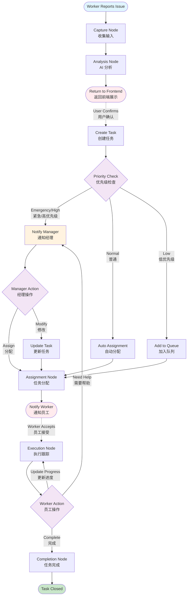
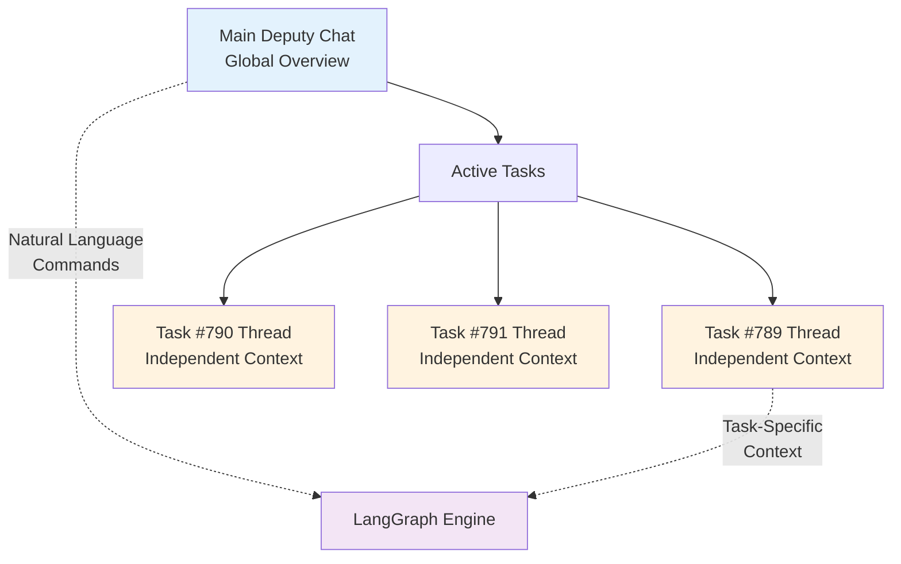
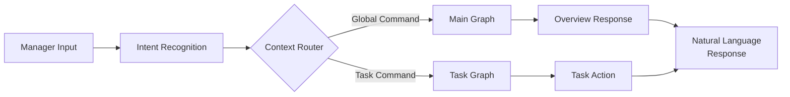
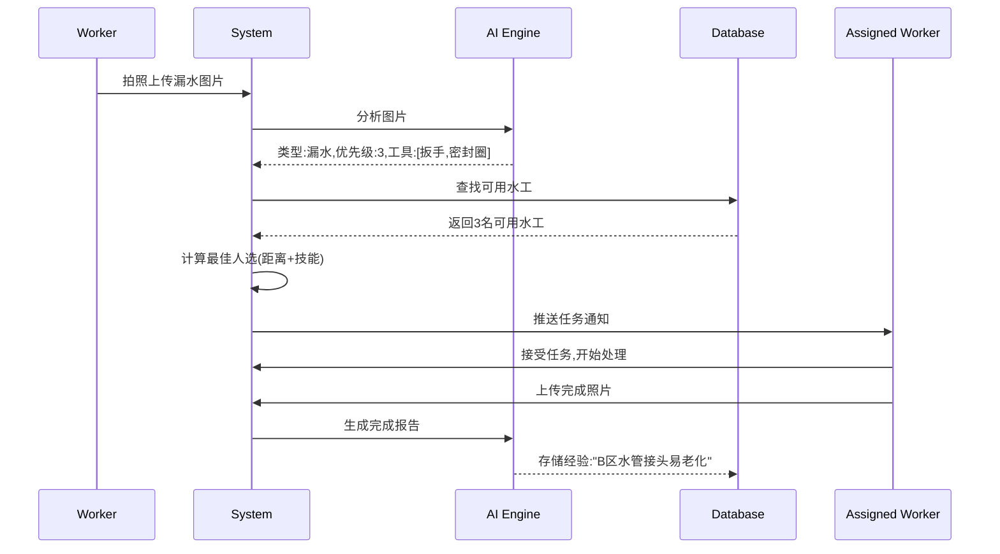
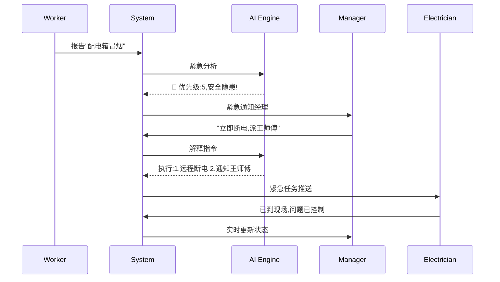
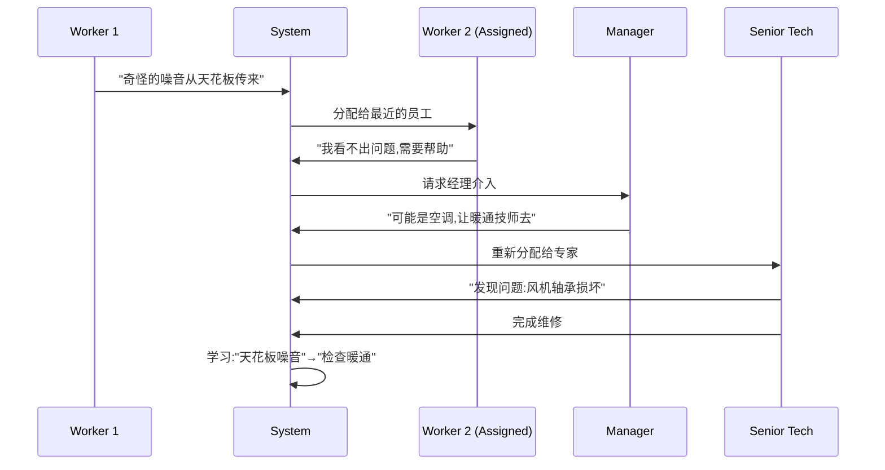
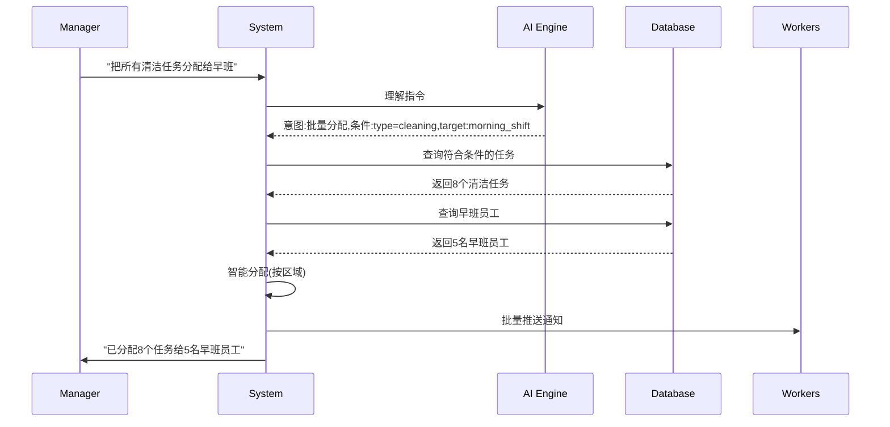
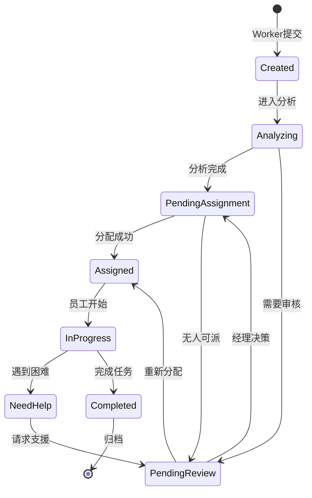

# Venue Ops LangGraph Architecture Documentation

## 📊 System Overview

这是一个基于 LangGraph 的智能任务处理系统，通过 AI Deputy（AI 助手）将 Worker（一线员工）和 Manager（管理者）智能连接起来，实现任务的智能创建、分析、分配和执行。

核心理念：**AI-First, Conversation-Driven** - 不是传统的 Dashboard，而是通过自然对话管理一切。

## 🔄 Core Workflow Graph (Updated with Human-in-the-Loop)



### 🔴 Human Interaction Points (人工交互点)

1. **After Analysis** → Worker confirms AI analysis before creating task
2. **AI Deputy Conversation** → Manager interacts via natural language
3. **After Assignment** → Worker accepts/rejects task
4. **During Execution** → Worker can request help or update progress
5. **After Completion** → Manager can review and close

## 🤖 AI Deputy - Conversation-Driven Management

### Concept: No Dashboard, Just Conversation

Traditional approach (❌):
```
Manager → Login → View Dashboard → Filter Tasks → Read Details → Assign
```

AI Deputy approach (✅):
```
AI: "3 urgent issues need attention"
Manager: "Handle the security one first"
AI: "Dispatching Tech Wang to West Gate camera"
```

### Dual-Layer Conversation Architecture



### Conversation Context Isolation

```python
# Each conversation maintains its own state
class ConversationContext:
    def __init__(self, context_type: str, context_id: str):
        self.type = context_type  # 'main' or 'task'
        self.id = context_id
        self.messages = []
        self.langgraph_state = {}
        
# Main Deputy Context - Overview and cross-task operations
main_context = ConversationContext('main', venue_id)

# Task Context - Isolated discussion about specific task
task_context = ConversationContext('task', task_id)
```

### Natural Language Command Processing



### Example Interactions

#### Main Deputy Chat:
```
AI: "Good afternoon. You have:
     • 2 urgent issues (security, maintenance)
     • 5 pending assignments
     • 3 tasks completed since noon"
     
Manager: "Show me the security issue"

AI: "Security Alert: West Gate camera offline
     Location: Zone A, Priority: High
     Tech Wang is 5 minutes away."
     [Open Task #789] [Dispatch Wang] [View Details]

Manager: "Dispatch Wang"

AI: "✓ Tech Wang dispatched to Task #789
     ETA: 5 minutes. Shall I open the task thread?"
```

#### Task Thread Chat:
```
[Entering Task #789 Context]

AI: "Task #789: West Gate Camera Malfunction
     Timeline:
     • 2:45 PM - Camera went offline
     • 3:00 PM - Reported by Security
     • 3:05 PM - You dispatched Tech Wang
     
     This camera had issues last week too."
     
Manager: "What was the problem last time?"

AI: "Nov 18: Ethernet cable replacement by Tech Li.
     Might be a recurring power supply issue.
     
     Suggested: Ask Wang to check power unit."
     
Manager: "Tell Wang to bring a spare power supply"

AI: "✓ Message sent to Tech Wang:
     'Please bring spare power supply unit for West Gate camera'"
```

## 🎯 Detailed Node Functions

### 1. **Capture Node** (捕获节点)
**Purpose**: 处理 Worker 的初始输入
```python
Input:
- images: List[str]       # 现场照片
- voice_url: str          # 语音描述
- location: dict          # GPS 位置
- manual_notes: str       # 文字说明

Process:
1. 存储图片到对象存储
2. 转录语音为文字
3. 验证位置信息
4. 生成初始任务 ID

Output:
- task_id: str
- image_urls: List[str]
- voice_transcript: str
- validated_location: dict
```

### 2. **Analysis Node** (分析节点)
**Purpose**: AI 理解和分类问题
```python
Input:
- All data from Capture Node
- Historical similar issues

Process:
1. GPT-4 Vision 分析图片
2. 理解语音/文字描述
3. 向量搜索相似历史问题
4. 确定问题类型和优先级

Output:
- issue_type: str         # leak|damage|malfunction|safety
- priority: 1-5           # 1=低, 5=紧急
- confidence: 0.0-1.0
- suggested_tools: List
- estimated_minutes: int
- ai_description: str
```

### 3. **Assignment Node** (分配节点)
**Purpose**: 智能分配给最合适的员工
```python
Input:
- Task analysis results
- Available workers list

Process:
1. 获取可用员工列表
2. 匹配技能要求
3. 计算位置距离
4. 考虑工作负载
5. 选择最佳人选

Output:
- assigned_to: worker_id
- estimated_arrival: minutes
- assignment_reason: str
```

### 4. **Manager Review Node** (经理审核节点)
**Purpose**: 经理介入和决策
```python
Input:
- Task with AI analysis
- Manager instructions (optional)

Process:
1. 展示任务详情给经理
2. 接收经理指令
3. AI 解释经理意图
4. 更新任务参数

Output:
- manager_decision: str
- priority_override: int
- assigned_to_override: str
- special_instructions: str
```

### 5. **Execution Node** (执行节点)
**Purpose**: 跟踪任务执行
```python
Input:
- Assigned task
- Worker updates

Process:
1. 记录开始时间
2. 接收进度更新
3. 处理额外照片/说明
4. 检测是否需要帮助

Output:
- status: in_progress|need_help|ready_to_complete
- progress_updates: List
- actual_duration: minutes
```

### 6. **Completion Node** (完成节点)
**Purpose**: 任务收尾和学习
```python
Input:
- Completed task data

Process:
1. 生成完成报告
2. 计算实际 vs 预估
3. 提取经验教训
4. 更新知识库

Output:
- resolution_summary: str
- lessons_learned: dict
- performance_metrics: dict
```

## 🎭 Use Case Scenarios

### Scenario 1: Simple Water Leak (简单漏水)
```
流程: Capture → Analysis → Auto-Assignment → Execution → Completion
时间: ~2 分钟系统处理，30分钟现场修复
```



### Scenario 2: Emergency Electrical Issue (紧急电力故障)
```
流程: Capture → Analysis → Manager Review → Assignment → Execution → Completion
时间: ~1 分钟升级到经理，5分钟内派遣
```



### Scenario 3: Unclear Issue Needing Help (不明问题需要帮助)
```
流程: Capture → Analysis → Assignment → Execution → Manager Review → Re-assignment → Completion
时间: 初始处理后请求支援
```



### Scenario 4: Manager Proactive Command (经理主动指令)
```
流程: Manager Command → AI Interpretation → Batch Operations
时间: 即时执行
```



## 📈 State Transitions

任务在系统中的状态转换：



## 🔑 Key Decision Points

### 1. **After Analysis (分析后决策)**
```python
def route_after_analysis(state):
    if state["priority"] >= 5:
        return "emergency"  # → Manager Review
    
    if state["confidence"] > 0.8 and state["auto_assignable"]:
        return "auto_assign"  # → Assignment
    
    return "needs_review"  # → Manager Review
```

### 2. **During Execution (执行中决策)**
```python
def route_during_execution(state):
    if state["worker_requested_help"]:
        return "needs_help"  # → Manager Review
    
    if state["completion_reported"]:
        return "complete"  # → Completion
    
    return "continue"  # → Stay in Execution
```

## 🧠 Intelligence Features

### 1. **Learning from History**
- 每个完成的任务都会更新向量数据库
- 相似问题的解决方案会被推荐
- 系统逐渐学习场地特点

### 2. **Predictive Maintenance**
- 识别重复出现的问题
- 预测可能的故障点
- 主动建议预防措施

### 3. **Resource Optimization**
- 学习任务实际用时 vs 预估
- 优化人员调度算法
- 识别技能提升需求

## 🔗 Integration Points

### Worker Mobile App
```javascript
// 提交问题
POST /api/tasks/create
{
  images: [base64...],
  voice: audio_blob,
  location: {lat, lng, area, floor}
}

// 更新状态
POST /api/tasks/{id}/update-status
{
  status: "in_progress",
  notes: "已到达现场"
}
```

### Manager Dashboard
```javascript
// 自然语言指令
POST /api/managers/ai-command
{
  command: "显示所有紧急任务"
}

// 干预任务
POST /api/managers/tasks/{id}/intervene
{
  instruction: "优先处理,客户在等",
  priority_override: 5
}
```

## 📊 Performance Metrics

系统自动跟踪的关键指标：

1. **Response Time**: 从报告到分配的时间
2. **Resolution Time**: 从分配到完成的时间  
3. **First-Time Fix Rate**: 一次修复成功率
4. **AI Accuracy**: AI 分析准确度
5. **Worker Utilization**: 员工利用率

## 🚀 Future Enhancements

1. **AR 指导**: 通过 AR 眼镜指导维修
2. **IoT 集成**: 设备自动报告问题
3. **预测模型**: ML 模型预测故障
4. **语音助手**: 完全语音交互
5. **多场馆**: 跨场馆经验共享

---

这个架构的核心理念是：**AI 不是工具，而是连接 Worker 和 Manager 的智能神经系统**。每个任务都在教会系统变得更聪明！